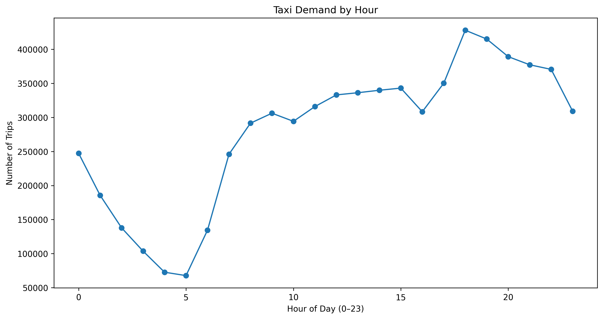
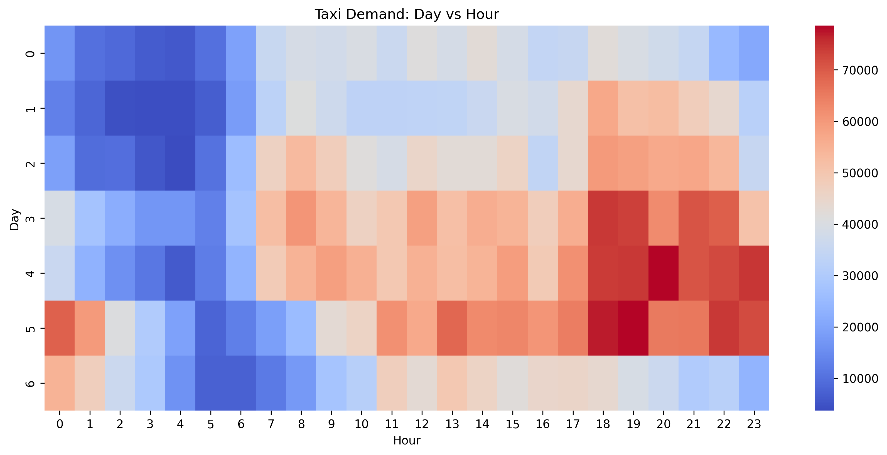

# 🚖 NYC Taxi Demand Analysis (Unsupervised Learning)

## 📌 Overview

This project analyzes NYC Yellow Taxi trip data to uncover **hidden patterns in rider behavior and demand** using clustering and time-based analysis.

The focus is on:

* Understanding **when** people use taxis
* Identifying **types of trips**
* Extracting **actionable insights** for operations

---

## 🎯 Objectives

* Segment trips using **K-Means clustering**
* Identify **peak and low demand hours**
* Analyze **weekly demand patterns (Mon–Sun)**
* Combine **time + cluster insights** for deeper understanding

---

## 🧠 Approach

### 1. Data Preprocessing

* Removed duplicates and invalid records
* Converted datetime columns
* Handled missing values

---

### 2. Feature Engineering

Created meaningful features:

* `trip_duration`
* `pickup_hour`
* `pickup_day`
* `is_weekend`

---

### 3. Clustering

* Applied **K-Means clustering**
* Selected optimal clusters using **Elbow Method**
* Interpreted clusters using:

  * Distance
  * Duration
  * Cost
  * Passenger count

---

### 4. Time-Based Analysis

* Hourly demand trends
* Day vs Hour heatmap
* Weekly demand comparison

---

## 📊 Key Visualizations

### 📈 Taxi Demand by Hour

---

### 🔥 Day vs Hour Heatmap

---

## 🔍 Key Insights

### ⏰ Hourly Patterns

* **Peak Hours:** 6 PM – 9 PM
* **Low Hours:** 3 AM – 5 AM
* Morning → commuting behavior
* Evening → return + leisure travel

---

### 📅 Weekly Patterns

* Demand gradually increases from **Monday → Saturday**
* **Saturday has the highest demand**
* Demand drops on **Sunday**

---

### 🎉 Weekend Behavior

* Saturday shows **high demand even at late night**
* Sunday shows **reduced activity**

---

### 🚖 Trip Segments (Clusters)

* Short daily commute trips
* Medium regular trips
* Long/high-value trips (evening dominant)
* Outliers removed during preprocessing

---

## 💼 Business Insights

* 🚖 Increase driver availability during **evening peak hours**
* 💰 Apply surge pricing on **Friday & Saturday nights**
* 📉 Reduce fleet during **early morning low-demand hours**
* 🎯 Optimize services for **commuters vs leisure users**

---

## 🛠️ Tech Stack

* Python
* Pandas
* NumPy
* Scikit-learn
* Matplotlib
* Seaborn

---

## 🚀 Conclusion

This project demonstrates how unsupervised learning combined with time-based analysis can reveal meaningful demand patterns in real-world transportation data.

---

## ⚠️ Note

This is a learning-focused project built to understand:

* Clustering techniques
* Feature engineering
* Real-world data analysis

---

## 👨‍💻 Author

Mahendiran
BSc IT Student | Aspiring AI/ML Engineer
